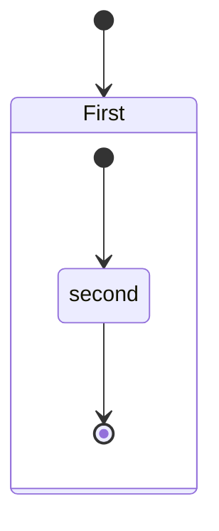
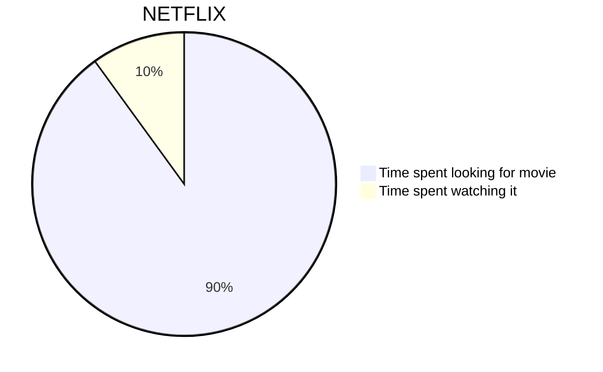
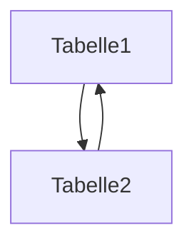
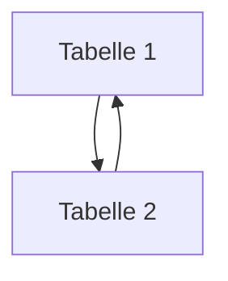
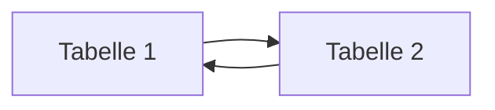
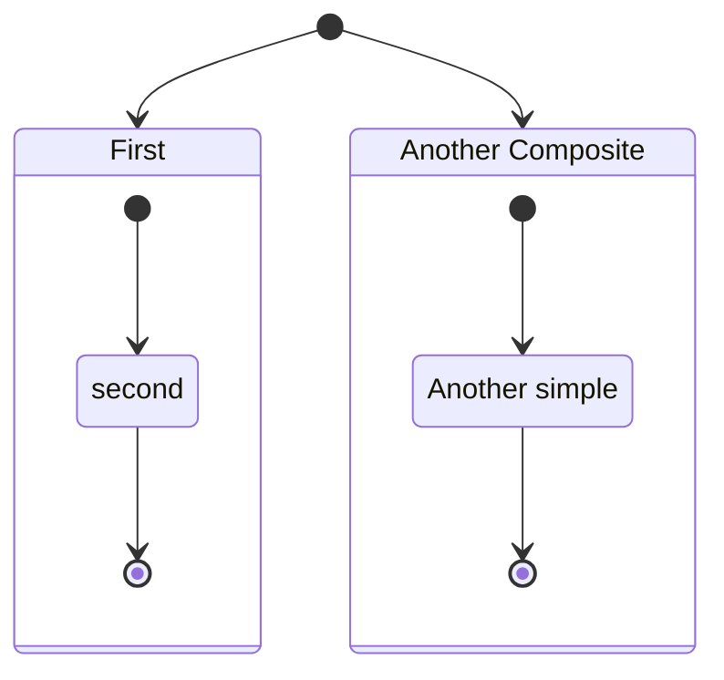
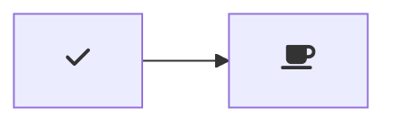

BASED ON: https://www.youtube.com/watch?v=_PPWWRV6gbA&t=60s

# Header
## Header 2

`inline code`

``` sql
--Dies ist ein Kommentar
SELECT * FROM customers
```

--two paragraphs
Normal Text 

New Paragraph  
seperation line
---
---
seperation line in one go
___
--two spaces and return: new line in same paragraph
Text again  
same Paragraph

bold: **bold**  
italics: *italics*  
bold and italics: ***both***  
strike throuch: ~~rubish~~  
highlight: ==this is the shit== (does not work because of markdown flavour)  
<mark>this is the shit</mark>

X<sup>2<sup>4</sup></sup> 2
H<sub>2<sub>4</sub></sub> 4

--one line code  
This is `let c = 2*x`

```js
//comment
const hi = "test";
```

```py
#comment
a = "test";
```
[This is a link](/page)  
[Google](https://google.com)  
--no formatting  
https://google.com  
image  


Quote
> i swear
>> by the moon and the stars and the sun
>>> i'll be  there

division line (all three are valid)
***
___
---

Ordered list (Ordering in beginning does not matter, i.e. 1. Item 1, 1. Item 2 still renders as 1. and 2. )
1. Item 1
2. Item 2
3. Item 3

Unordered list (works with "*", "-", "+")  
Tab key or 4 spaces indent bullet points
* Item 1
  * Bullet point with tab
* Item 2
    * Bullet point with 4 spaces
* Item 3

Table  
| Letter | Digit | Character |
| :----: | :---: | :-------: |
| a      | 4     | $         |
|        | <b>365</b>   | (         |
| b      |       | ^         |

Table (divisor: :--- or --- = left align, ---: right align, :---: center align)  
| Letter | Digit | Character |
| --- | --- | -------: |
| a      | 4     | $         |
|        | <b>365</b>   | (         |
| b      |       | ^         |

This is a regular paragraph.

<table>
    <tr>
        <td>Foo</td>
    </tr>
</table>

This is another regular paragraph.

- [ ] Checkbox unticked
- [x] Checkbox ticked

<input type="checkbox" checked> some checked text  
<input type="checkbox"> some unchecked text  

Extension: Markdown PDF -> https://marketplace.visualstudio.com/items?itemName=yzane.markdown-pdf 

Extension: Markdown Preview Mermaid Support ->  https://marketplace.visualstudio.com/items?itemName=bierner.markdown-mermaid







SET operators

JOIN 



???
"markdown.styles": [
    "https://use.fontawesome.com/releases/v5.7.1/css/all.css"
]


https://github.com/ikatyang/emoji-cheat-sheet/blob/master/README.md
Extension: Markdwon Emoji
:blush:
:smirk:
:smile:
:grin:
:anguished: 
:worried:
:confused:
:hushed:
:upside_down_face:
:hand_over_mouth:
:thumbsup:
:shrug:
:wink:
:thinking:
:zipper_mouth_face:
:roll_eyes:
:raised_eyebrow:
:relieved:
:vomiting_face:
:sunglasses:
:monocle_face:
:see_no_evil: :hear_no_evil: :speak_no_evil:
:eyes:
:muscle:
:frog:

:negative_squared_cross_mark:
:x:
:heavy_check_mark:
:white_check_mark:
:question:  

:bangbang:
:exclamation:
:heavy_exclamation_mark:

Extension: Markdown Shortcuts


