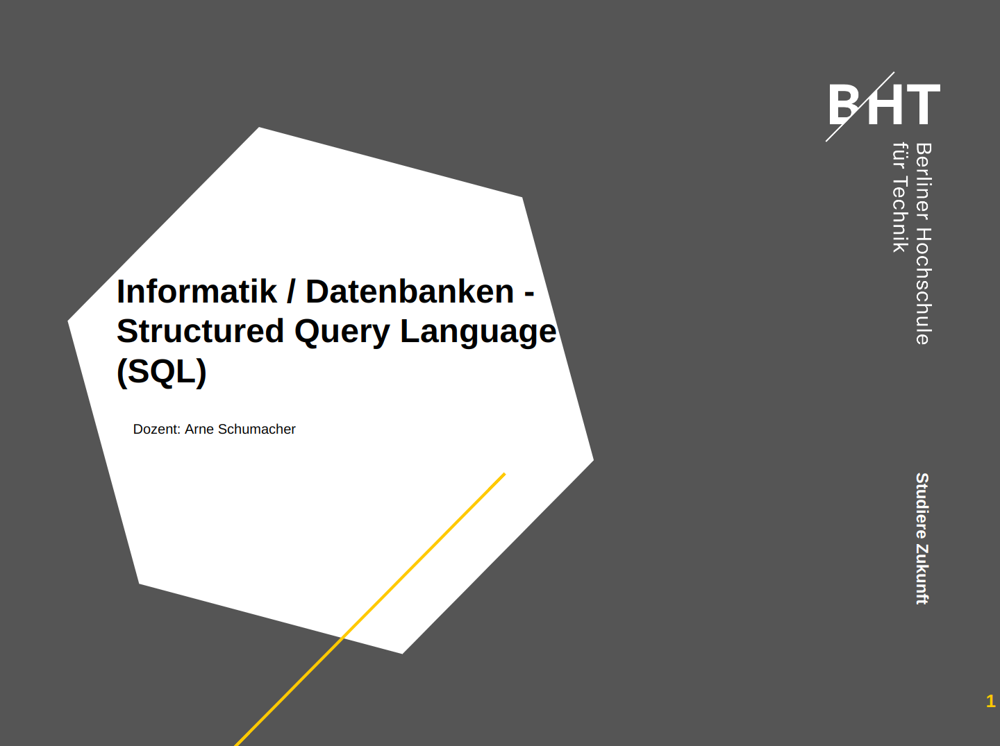
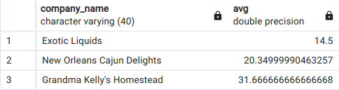
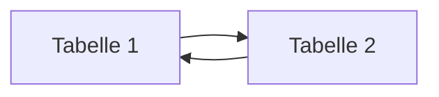
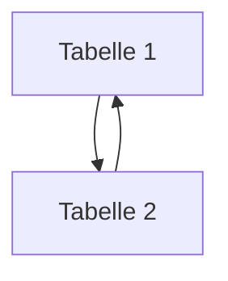

# Structured Query Language (SQL)

+ SQL erlaubt die Abfrage, das Editieren, Ändern und Löschen von Informationen in einer Datenbank
+ SQL ist standardisiert und funktioniert (fast) auf jedem Datenbanksystem gleich
+ Der Standard wird festgelegt von der American National Standards Institute (ANSI) in 1986 und von der International Organization for Standardization (ISO) in 1987
  + Standardisierung ermöglicht eine weite Verbreitung und Nutzung -> nicht jedes System hat seinen eigenen Standard, da Kompatibilität gewahrt bleibt
+ Allerdings hat jedes Datenbanksystem auch immer noch Abweichungen (flavours, dialects)  und eigene Implementationen  
+ SQL gehört zur 4. Generation (4GL) an Programmiersprachen und ist rein deklarativ:
  + Daten werden angefordert, man hat aber keinen Einfluss, wie diese Daten abgeholt werden
  + Diese Logik ist komplett dem RDMS überlassen 

## SQL auf einen Blick

Statement| Zugehörig
------- | -------
SELECT | **Data retrieval (Abfrage)**
CREATE<br>ALTER<br>DROP | **Data definition language (DDL)**
INSERT<br>UPDATE<br>DELETE<br>MERGE<br>TRUNCATE<br> | **Data manipulation language (DML)**    
COMMIT<br>ROLLBACK<br>SAVEPOINT<br> | **Transaction control**
GRANT<br>REVOKE<br> | **Data control language (DCL)**
<br>
+ :heavy_check_mark: Dies sind bereits alle möglichen SQL-Statements
+ Data definition language (DDL) ermöglicht das Erstellen oder Ändern des Datenmodells
+ Data Manipulation Language (DML) bezieht sich auf die Daten selbst, also das Hinzufügen, Ändern oder Löschen von Daten
+ Transaction control erzwingt die Konsistenz beim Schreiben der Daten
+ Data Control Language (DCL) richtet die Zugangskontrolle für Datenbankobjekte ein. Über Nutzer und Rollen kann ein sehr filigraner Zugriffsschutz erstellt werden 

# Data Definition Language (DDL)

## Wie erstelle ich ein Datenmodell?

An Anfang muss die Grundstuktur (Datenmodell) geschaffen werden, um Daten aufzunehmen. Später kann das Datenmodell auch geändert werden:

- Das Datenmodell kann:
  - Tabellen erzeugen (CREATE TABLE)
  - Tabellen ändern (ALTER TABLE)
  - Tabellen löschen (DROP TABLE)

## Tabellen erzeugen

+ Tabellen zu erzeugen ist der Anfang aller Datenmodelle
+ Grundsätzlich wird es durch das `CREATE TABLE` Statement erstellt:
  + der Name der Tabelle
  + Spaltennamen und Datentypen
  + Konsistenzprüfungen (Constraints) definiert
    + Constraints können sein:
      + CHECK (Domäne = Spalte)
      + PRIMARY KEY (Entität = Tabelle)
      + FOREIGN KEY (referentiell = zu anderen Tabellen)

```sql
--erzeugt Tabelle mit Spalten, Datentypen & Integritätsbedingungen
CREATE TABLE tabelle (
    id int PRIMARY KEY,     --PRIMARY KEY (Entität)
    vorname varchar(50) NOT NULL, -- CHECK CONSTRAINT (Domäne)
    nachname varchar(50) NOT NULL,
    abteilungs_id smallint REFERENCES abteilung (id)  --FOREIGN KEY (referentiell)
);
```

[mehr hierzu: CREATE TABLE](https://www.postgresql.org/docs/current/sql-altertable.html)

+ Tabellen können immer geändert werden, z. B.:
  + Spalten ergänzt oder vom Datentyp geändert
  + Integritätsbedingungen ergänzt oder verändert werden
  + ... etc.

```sql 
ALTER TABLE table_name [ADD | DROP | ALTER] [COLUMN | CONSTRAINT] 
```
- oder gelöscht werden:

```sql
DROP TABLE table_name [CASCADE] --CASCADE = Lösche auch Objekte die vom gelöschten Objekt abhängen
```  


# Data Manipulation Language

## Wie ändere ich Daten in den Tabellen?

Nachdem das Datenmodell erstellt ist, muss es mit Leben (Daten) gefüllt werden:  

- Daten können:
  - eingefügt (INSERT)
  - aktualisiert (UPDATE) oder
  - gelöscht (DELETE) werden

### Wie kriege ich Daten in die Datenbank?

```sql
--alle Spalten gegeben
INSERT INTO tabelle VALUES (1, 'Wert 1', 'Wert 2');

--mit Spaltenauswahl
INSERT INTO (col2, col4) VALUES (1, 'Wert 1')

-- Mehrere Zeilen
INSERT INTO tabelle VALUES 
(1, 'Wert 1'),
(2, 'Wert 2')
```

```sql
--Tabelle muss bereits bestehen
COPY
```

```sql
-- Neue Tabellen aus bestenden Tabellen erzeugen
CREATE TABLE AS SELECT * FROM tabelle

SELECT * INTO [table_name] FROM ...
```
### Automatisiert

psql  

IDE, z. B. python (import pyodbc, import psycopg)

```sql
UPDATE tabelle SET spalte = 'Wert' WHERE spalte = 'Wert'
```

```sql
DELETE FROM tabelle WHERE spalte = 'Wert'
```
## Aufgabe 1

Erstellen Sie über pgAdmin und seinem ERD-Tool ein Datenmodell, das eine Anwendung in ihrem Studium oder ähnliches implementiert. Was Sie modellieren können Sie beliebig wählen. Achten Sie aber bitte darauf, folgende Punkte zu integrieren:

1) Das Datenmodell enthält ca. 5 Tabellen
2) mindestens **eine** 1:n, n:m Beziehung zwischen den Tabellen
3) Setzen Sie in ihrem Modell auch mindestens **eine** der 3 Integritätsbedingungen in den Tabellen um, d. h.:
+ Domänenintegrität
+ Primärschlüssel (für alle Tabellen)
+ Fremdschlüssel (für die 1:n & n:m Beziehungen)
4) Füllen Sie die Tabellen mit ein paar Beispieldatensätzen (hier reichen wenige)

+ Provozieren Sie nun für jeden INSERT INTO Befehl eine Verletzung der Integritätsbedingungen. Wie sind die Fehlermeldungen?

### Datenabfrage (SELECT)

+ SELECT ist ein sehr mächtiger Befehl, um Daten aus Tabellen abzufragen
+ Wenn die Daten bereits definiert sind (DDL), bewegt man sich fast ausschließlich mit diesem Befehl, um Daten zu analysieren und auszuwerten
+ Daten können sehr effizient zusammengefügt und verbunden werden. 
  + Die Analyse von Daten wird im Vergleich zu z. B. Excel wesentlich flexibler und einfacher

```sql
-- Ich bin ein Kommentar
SELECT * FROM products;
```
+ :arrow_up: Zur Einführung ein Code-Beispiel, wie wir es auf den nächsten Seiten öfter sehen werden

+ :arrow_down: Ein wichtiger Einstieg in SQL ist die Selektion von Spalten und Zeilen, fangen wir mit den Spalten an: 

```sql
-- Wie selektiere ich Spalten?
SELECT product_name, quantity_per_unit FROM products; --product_name = Spalte

SELECT * FROM products --alle Spalten
```
### Operatoren

+ Wie selektiere (filtere) ich Zeilen? :arrow_down::

+ mit dem WHERE statement:

```sql
SELECT * FROM products
WHERE spalten_name = 'Wert'
```
#### Arithmetisch

Operator | Bedeutung
---------|----------
= | ist gleich
< | kleiner
<= | kleiner gleich
\> | größer
\>= | größer gleich
<> oder != | ungleich

#### Null-Werte

Operator | Bedeutung
---------|----------
is Null | Null-Werte 
is not Null | nicht Null-Werte

+ :information_source: Null-Werte stehen für unbekannte Werte 

```sql
-- Alle Produkte größer gleich $50
SELECT * FROM products
WHERE unit_price >= 50
```
#### AND, NOT, OR

Operator | Beschreibung
---------|-------------
AND | Alle Bedingungen müssen erfüllt sein
OR | Nur eine Bedingung muss erfüllt sein
NOT | Negation 

##### Beispiele
```sql
-- Alle Produkte, die mit "A" anfangen UND über 50 $ kosten
SELECT * FROM products WHERE product_name LIKE 'A%' and unit_price > 50
-- Alle Produkte, die **nicht** mit "B" anfangen 
SELECT * FROM products WHERE product_name NOT LIKE ('B%')  
```

```sql
-- Welche Produkte kosten über $50?
SELECT product_id, product_name
FROM products
WHERE unit_price >= 50;
```
+ Eine Besonderheit im `WHERE` Keyword ist das Filtern mit `LIKE`:

```sql 
SELECT * FROM products
-- 1) Mit "A" startet
WHERE productname LIKE 'A%'  
-- 2) "A" enthält
WHERE productname LIKE '%a%'
-- 3) Mit "A" endet
WHERE productname LIKE '%a'
```

### Aggregate Functions

+ Aggregatfunktionen sind Funktionen, die über alle oder bestimmte Spalten aggregieren 
+ :arrow_up: Beispiele siehe `GROUP BY` oben

```sql
-- Was ist das teuerste Produkt? (Aggregation auf gesamte Tabelle)
SELECT MAX(unit_price) 
FROM products;
```

```sql
-- Was ist der Durchschnittspreis pro Händler? (Aggregation auf eine Spalte (supplier_id))
SELECT supplier_id, AVG(unit_price) 
FROM products
GROUP BY supplier_id
ORDER BY avg
```
+ :arrow_up: :exclamation: Jede Spalte, die im `SELECT ` Keyword auftaucht (außer der Aggregationsfunktion selbst), muss auch im `GROUP BY` Keyword vorkommen

```sql
-- Geht das bitte mit aufgelöstem Händlername?
SELECT company_name, avg FROM suppliers
LEFT JOIN
(SELECT supplier_id, AVG(unit_price) 
FROM products
GROUP BY supplier_id
ORDER BY avg) ave_price ON suppliers.supplier_id=ave_price.supplier_id
```


+ :information_source: :arrow_down: Ein SELECT-Statement kann insgesamt folgende Keywords enthalten:

Keyword | Beschreibung
:--- | -------:
<span style="color:blue">**SELECT**</span> | Filtert Spalten ("*" für alle)
<span style="color:blue">**FROM**</span> | Tabelle
<span style="color:blue">**WHERE**</span> | Filtert Zeilen
<span style="color:blue">**GROUP BY**</span> | Ermöglicht das Aggregieren auf Spalten, z. B. mit SUM(), MAX(), MIN(), COUNT(), AVG()
<span style="color:blue">**HAVING**</span> | Filtert wieder Zeilen **nach** dem Aggregieren
<span style="color:blue">**ORDER BY**</span> | Sortiert Ergebnis nach Spalte
<span style="color:blue">**LIMIT**</span> | Limitiert die Ergebnisse auf eine bestimmte Anzahl, z. B. 100 | 

## SQL JOINS



+ :arrow_up: Tabellen werden hier horizontal verbunden, d.h. die Spaltenanzahl erhöht sich bis auf alle Spalten von beiden Tabellen (solange keine Spaltenselektion vorgenommen wird)
+ JOINS verbinden Tabellen (in der Regel) auf einen bestimmten Schlüssel -> referentielle Integrität
+ So können Daten wieder denormalisiert werden und lesbar gemacht werden. 
+ Wir erinnern uns: Datentabellen enthalten nur Schlüssel, ähnlich wie hier (order_details):

customer_id | product_id | Kaufdatum
-----------|------------|----------
1 | 14 | 01.04.2024
2 | 16 | 03.01.2025

+ :arrow_up: Um Daten wieder lesbar zu machen, müssen Sie über einen JOIN wieder verknüpft werden, d. h. die Schlüssel (hier Fremdschlüssel) der Primärtabelle angehängt werden

```sql
--Welche Firma (customer) hat welche Produkte gekauft? 
SELECT company_name, product_name FROM order_details
LEFT JOIN orders ON order_details.order_id=orders.order_id
LEFT JOIN customers ON orders.customer_id=customers.customer_id
LEFT JOIN products on order_details.product_id=products.product_id
WHERE order_details.order_id=10248
```

+ JOINS können INNER, OUTER oder CROSS sein


[Source: https://www.linkedin.com/pulse/sql-inner-join-tutorial-matt-l](https://www.linkedin.com/pulse/sql-inner-join-tutorial-matt-l)

## SET Operatoren

SET operators

+ :arrow_up: SET Operatoren hängen Tabellen zusammen bzw. finden die Differenz in den Zeilen
+ :exclamation: Hierfür müssen die Tabellen, die exakt gleiche Anzahl an Spalten und gleiche Datentypen haben
+ SET Operatoren verbinden Tabellen vertikal, sie erhöhen oder vermindern die Zeilenanzahl

Operator | Bedeutung
---------|----------
UNION oder UNION ALL | Hängt 2 Tabellen aneinander, UNION ALL erlaubt Duplikate, UNION entfernt diese
INTERSECT | gibt die Menge der überschneidenden Elemente zurück (d. h. sowohl in Tabelle 1 als auch 2 enthalten) 
MINUS | findet die Menge, die nur in der einen, nicht aber in der anderen Tabelle ist 

```sql
SELECT product_name, quantity_per_unit, unit_price FROM products
INTERSECT
SELECT product_name, quantity_per_unit, unit_price FROM products
WHERE product_id != 1
```