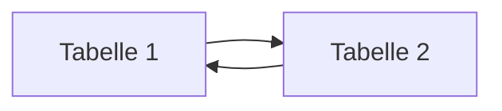
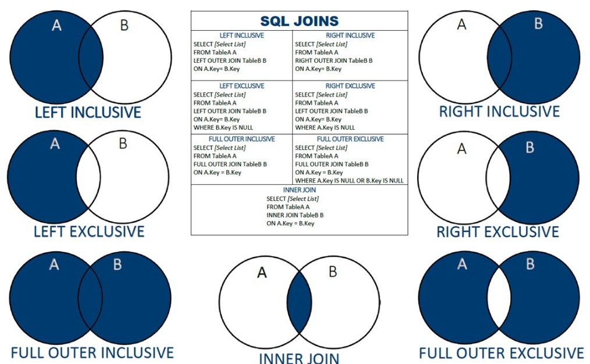
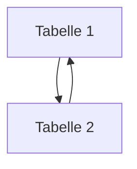
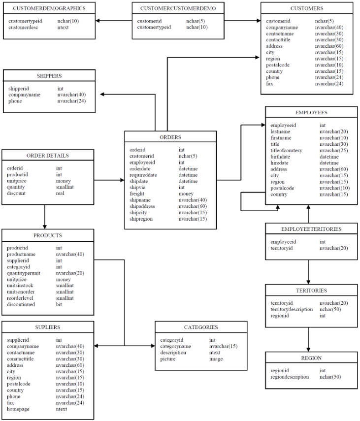

# Structured Query Language (SQL)

## Warum SQL?

+ Datenbanken und SQL sind aus der Informatik nicht mehr wegzudenken und bilden die Basis für alle Datenverarbeitungsprozesse inklusive:
  + Speichern von Daten
  + Analysieren von Daten
  + Visualisieren von Daten
+ Alle Daten, auch die Daten die im Internet getauscht, dargestellt und gepostet werden haben als Backend eine Datenbank, die z. B. genutzt wird für:
  + Formulardaten zum Einkaufen, Registrieren und Anmelden 
  + Content-Management-Systemen
  + Blogs & Social Media
  + Die Daten werden bei der Eingabe auf einer Webseite über ein Datenaustauschformat, z. B. JSON oder XML vom Client (Webseite) zum Server (Datenbank) geschickt
    + Hierbei wird geprüft, ob die Daten 
      1) konform (konsistent) zum Datenmodell sind (Stichwort: ACID, mehr dazu später :arrow_down:) und 
      2) werden vom Austauschformat in SQL übersetzt (von einem Objekt in relationale Daten überführt (Object-Relational-Mapping))  
    + Dies geschieht meist vollautomatisiert und ohne größeren Aufwand beim Programmieren, da es hierfür zahlreiche Bibliotheken gibt, z. B. Java Hibernate
+ SQL ist auch zentraler Bestandteil für neue Felder wie:
  + KI/AI
  + Machine Learning
  + Natural Language Processing
  + Robotik
  + Industrie 4.0
  + ...

## Was kann SQL?
+ SQL erlaubt die Abfrage, das Editieren, Ändern und Löschen von Informationen in einer Datenbank
+ SQL ist standardisiert und funktioniert (fast) auf jedem Datenbanksystem gleich
+ Der Standard wird festgelegt von der American National Standards Institute (ANSI) in 1986 und von der International Organization for Standardization (ISO) in 1987
  + Standardisierung ermöglicht eine weite Verbreitung und Nutzung -> nicht jedes System hat seinen eigenen Standard, da Kompatibilität gewahrt bleibt
+ Allerdings hat jedes Datenbanksystem auch immer noch Abweichungen (flavours, dialects)  und eigene Implementationen  
+ SQL gehört zur 4. Generation (4GL) an Programmiersprachen und ist rein deklarativ:
  + Daten werden angefordert, man hat aber keinen Einfluss, wie diese Daten abgeholt werden
  + Diese Logik ist komplett dem RDMS überlassen
  + Unter der Haube arbeitet ein Query Optimiser, der Anfragen optimiert und sie im Arbeitsspeicher (RAM) bereitstellt
  + Auch wo und wie die Daten physisch gespeichert werden, ist komplett dem RDBMS überlassen
    + dies erschwert aber auch einen einfachen Austausch der Daten 

## Wie "spreche" ich mit der Datenbank?

+ Datenbankmanagementsysteme erlauben in der Regel den Zugriff über:
  + eine graphische Benutzeroberfläche (GUI)
    + für PostgreSQL ist das pgAdmin
  + über die Kommandozeile: psql -h localhost postgres postgres
  + über eine Schnittstelle (API, z. B. pyodbc für Python)

+ Für dieses Modul beschränken wir uns auf die GUI -> pgAdmin

## SQL auf einen Blick

Statement| Zugehörig
------- | -------
SELECT | **Data retrieval (Abfrage)**
CREATE<br>ALTER<br>DROP | **Data definition language (DDL)**
INSERT<br>UPDATE<br>DELETE<br>TRUNCATE<br> | **Data manipulation language (DML)**    
COMMIT<br>ROLLBACK<br>SAVEPOINT<br> | **Transaction control**
GRANT<br>REVOKE<br> | **Data control language (DCL)**
<br>
    
+ :heavy_check_mark: Dies sind bereits alle möglichen SQL-Statements
+ Data definition language (DDL) ermöglicht das Erstellen oder Ändern des Datenmodells
+ Data Manipulation Language (DML) bezieht sich auf die Daten selbst, also das Hinzufügen, Ändern oder Löschen von Daten
+ Transaction control erzwingt die Konsistenz beim Schreiben der Daten
+ Data Control Language (DCL) richtet die Zugangskontrolle für Datenbankobjekte ein. Über Nutzer und Rollen kann ein sehr filigraner Zugriffsschutz erstellt werden
    
:arrow_down: Zur Einführung ein Code-Beispiel, wie wir es auf den nächsten Seiten öfter sehen werden
```sql
-- Ich bin ein Kommentar, die nächste Zeile ist SQL
SELECT * FROM products;
```  

# Data Definition Language (DDL)

## Wie erstelle ich ein Datenmodell?

An Anfang muss die Grundstuktur (Datenmodell) geschaffen werden, um Daten aufzunehmen. Später kann das Datenmodell auch geändert werden:

- Das Datenmodell kann:
  - Tabellen erzeugen (CREATE TABLE)
  - Tabellen ändern (ALTER TABLE)
  - Tabellen löschen (DROP TABLE)

## Tabellen erzeugen

+ Tabellen zu erzeugen ist der Anfang aller Datenmodelle
+ Grundsätzlich wird es durch das `CREATE TABLE` Statement erstellt und enthält folgende Elemente:
  + der Name der Tabelle
  + Spaltennamen und Datentypen
  + Konsistenzprüfungen (Constraints) definiert
    + Constraints können sein:
      + CHECK (Domäne = Spalte)
      + PRIMARY KEY (Entität = Tabelle)
      + FOREIGN KEY (referentiell = zu anderen Tabellen)

```sql
--erzeugt Tabelle mit Spalten, Datentypen & Integritätsbedingungen
CREATE TABLE tabelle (
    id int PRIMARY KEY,     --PRIMARY KEY (Entität)
    vorname varchar(50) NOT NULL, -- CHECK CONSTRAINT (Domäne)
    nachname varchar(50) NOT NULL,
    abteilungs_id smallint REFERENCES abteilung (id)  --FOREIGN KEY (referentiell)
);
```

[mehr hierzu: CREATE TABLE](https://www.postgresql.org/docs/current/sql-altertable.html)

+ Tabellen können immer geändert werden, z. B.:
  + Spalten ergänzt oder vom Datentyp geändert
  + Integritätsbedingungen ergänzt oder verändert werden
  + ... etc.

```sql 
ALTER TABLE table_name [ADD | DROP | ALTER] [COLUMN | CONSTRAINT] 
```
- oder gelöscht werden:

```sql
DROP TABLE table_name [CASCADE] --CASCADE = Lösche auch Objekte die vom gelöschten Objekt abhängen
```  


# Data Manipulation Language

## Wie ändere ich Daten in den Tabellen?

Nachdem das Datenmodell erstellt ist, muss es mit Leben (Daten) gefüllt werden:  

- Daten können:
  - eingefügt (INSERT)
  - aktualisiert (UPDATE) oder
  - gelöscht (DELETE) werden

### Wie kriege ich Daten in die Datenbank?

- Wenn wir das Datenmodell erschaffen haben, müssen wir die Tabellen mit Leben füllen. Nachfolgend sind Bespiele mit folgenden Befehlen:
  - INSERT INTO
    - Tabelle muss existieren
  - COPY (transferiert Daten in eine Tabelle oder exportiert diese in eine Datei, z. B. *.csv)
    - Tabelle muss existieren
  - CREATE TABLE AS SELECT
    - Tabelle wird erstellt
  - SELECT * INTO ... FROM
    - Tabelle wird erstellt   

  
```sql
--alle Spalten gegeben
INSERT INTO tabelle VALUES (1, 'Wert 1', 'Wert 2');

--mit Spaltenauswahl
INSERT INTO (col2, col4) VALUES (1, 'Wert 1')

-- Mehrere Zeilen
INSERT INTO tabelle VALUES 
(1, 'Wert 1'),
(2, 'Wert 2')
```

```sql
-- Daten in Tabelle einfügen
COPY table_name (column1, column2, ...)
FROM '/path/to/file.csv'
WITH (FORMAT csv, HEADER true);

-- Daten aus Tabelle exportieren
COPY table_name (column1, column2, ...)
TO '/path/to/output.csv'
WITH (FORMAT csv, HEADER true);
```

```sql
-- Neue Tabellen aus bestehenden Tabellen erzeugen
CREATE TABLE AS SELECT * FROM tabelle

SELECT * INTO [table_name] FROM ...
```
### Automatisiert

psql  

IDE, z. B. python (import pyodbc, import psycopg)
 
### Daten aktualisieren

```sql
UPDATE tabelle SET spalte = 'neuer Wert' WHERE spalte = 'alter Wert'

-- Hier ein komplizierteres UPDATE statement, das Zellen basierend auf einem anderen Spaltenwert updated:
UPDATE employees
SET salary = su.new_salary
FROM salary_updates su
WHERE employees.id = su.id;
```

### Daten löschen

```sql
DELETE FROM tabelle WHERE spalte = 'Wert'

-- Was macht folgender Befehl? :-D
DELETE FROM employees;
```
## Aufgabe 2

:exclamation: Die folgende Aufgabe enthält zunächst die Erstellung eines konzeptionellen Datenbank-Modells (ERM), das wir in SQL transformieren und aus dem wir ein physisches Modell generieren und mit Beispieldaten füllen und Integritätsverletzungen provozieren. Bitte geben Sie für die Aufgabe ein Lösungsdokument im *.docx oder *.pdf Format ab, aus dem ALLE wichtigen Schritte hervorgehen.   

Erstellen Sie über pgAdmin und seinem ERD-Tool ein Datenmodell, das eine Anwendung in ihrem Studium oder ähnliches implementiert. Was Sie modellieren können Sie beliebig wählen. Achten Sie aber bitte darauf, folgende Punkte zu integrieren:

1) Das Datenmodell enthält ca. 5 Tabellen
    + Achten Sie auf die richtige Vergabe des Datenyps
    + Jede Tabelle sollte auch einen Primärschlüssel haben
    + Wo es Sinn ergibt, setzen Sie auch Constraints (Not Null, CHECK) 
2) mindestens **eine** 1:n, n:m Beziehung zwischen den Tabellen
    + Setzen Sie hier die referentielle Integrität für die Beziehungen zwischen den Tabellen
3) Setzen Sie in ihrem Modell auch mindestens **eine** der 3 Integritätsbedingungen in den Tabellen um, d. h.:
+ Domänenintegrität
+ Primärschlüssel (für alle Tabellen)
+ Fremdschlüssel (für die 1:n & n:m Beziehungen)
4) Lassen Sie sich aus dem graphischen Modell SQL generieren (Generate SQL) und spielen Sie diese Statements zurück in eine Datenbank
5) Füllen Sie die Tabellen mit ein paar Beispieldatensätzen (hier reichen wenige)

+ Provozieren Sie nun für jeden INSERT INTO Befehl eine Verletzung der Integritätsbedingungen. Wie sind die Fehlermeldungen?

## Datenabfrage (SELECT)

+ `SELECT` ist ein sehr mächtiger Befehl, um Daten aus Tabellen abzufragen
+ Wenn die Daten bereits definiert (DDL) und befüllt (DML) sind, bewegt man sich fast ausschließlich mit diesem Befehl, um Daten zu analysieren und auszuwerten
+ Daten können sehr effizient zusammengefügt und verbunden werden. 
  + Die Analyse von Daten wird im Vergleich zu z. B. Excel wesentlich flexibler und einfacher

+ :arrow_down: Ein wichtiger Einstieg in SQL ist die Selektion von Spalten und Zeilen, fangen wir mit den Spalten an: 

```sql
-- Wie selektiere ich Spalten?
SELECT product_name, quantity_per_unit FROM products; --product_name & quantity_per_unit = Spaltennamen

SELECT * FROM products; --alle Spalten
```
### Operatoren

+ Wie selektiere (filtere) ich Zeilen?:

+ mit dem WHERE statement :arrow_down::

```sql
SELECT * FROM products
WHERE spalten_name = 'Wert'
```
#### Arithmetisch

Operator | Bedeutung
---------|----------
= | ist gleich
< | kleiner
<= | kleiner gleich
\> | größer
\>= | größer gleich
<> oder != | ungleich

```sql
-- Alle Produkte größer gleich $50
SELECT * FROM products
WHERE unit_price >= 50
```

#### Null-Werte

+ :information_source: Null-Werte stehen für unbekannte Werte 

Operator | Bedeutung
---------|----------
is Null | Null-Werte 
is not Null | nicht Null-Werte

#### AND, NOT, OR

Operator | Beschreibung
---------|-------------
AND | Alle Bedingungen müssen erfüllt sein
OR | Nur eine Bedingung muss erfüllt sein
NOT | Negation 

##### Beispiele
```sql
-- Alle Produkte, die mit "A" anfangen UND über 50 $ kosten
SELECT * FROM products WHERE product_name LIKE 'A%' and unit_price > 50 
```

```sql
-- Welche Produkte kosten über zwischen $ 50-100?
SELECT product_id, product_name
FROM products
WHERE unit_price >= 50 and unit_price <= 100;
```
+ Eine Besonderheit im `WHERE` Keyword ist das Filtern mit `LIKE`:

```sql 
SELECT * FROM products
-- 1) Mit "A" startet
WHERE productname LIKE 'A%'  
-- 2) "A" enthält
WHERE productname LIKE '%a%'
-- 3) Mit "A" endet
WHERE productname LIKE '%a'

-- Alle Produkte, die **nicht** mit "B" anfangen 
SELECT * FROM products WHERE product_name NOT LIKE ('B%') 
```

### Aggregate Functions

+ Aggregatfunktionen sind Funktionen, die über alle oder bestimmte Spalten aggregieren 
+ :arrow_donw: Beispiele siehe `GROUP BY` oben

```sql
-- Was ist das teuerste Produkt? (Aggregation auf gesamte Tabelle)
SELECT MAX(unit_price) 
FROM products;
```

```sql
-- Was ist der Durchschnittspreis pro Händler? (Aggregation auf eine Spalte (supplier_id))
SELECT supplier_id, AVG(unit_price) 
FROM products
GROUP BY supplier_id
ORDER BY avg
```
+ :arrow_up: :exclamation: Jede Spalte, die im `SELECT` Keyword auftaucht (außer der Aggregationsfunktion selbst), muss auch im `GROUP BY` Keyword vorkommen

```sql
-- Geht das bitte mit aufgelöstem Händlername?
SELECT company_name, avg FROM suppliers
LEFT JOIN
(SELECT supplier_id, AVG(unit_price) 
FROM products
GROUP BY supplier_id
ORDER BY avg) ave_price ON suppliers.supplier_id=ave_price.supplier_id

HIER FEHLT GANZ NORMALER JOIN 
```


+ :information_source: :arrow_down: Ein SELECT-Statement kann insgesamt folgende Keywords enthalten:

Keyword | Beschreibung
:--- | -------:
<span style="color:blue">**SELECT**</span> | Filtert Spalten ("*" für alle)
<span style="color:blue">**FROM**</span> | Tabelle
<span style="color:blue">**WHERE**</span> | Filtert Zeilen
<span style="color:blue">**GROUP BY**</span> | Ermöglicht das Aggregieren auf Spalten, z. B. mit SUM(), MAX(), MIN(), COUNT(), AVG()
<span style="color:blue">**HAVING**</span> | Filtert wieder Zeilen **nach** dem Aggregieren
<span style="color:blue">**ORDER BY**</span> | Sortiert Ergebnis nach Spalte
<span style="color:blue">**LIMIT**</span> | Limitiert die Ergebnisse auf eine bestimmte Anzahl, z. B. 100 | 

## SQL JOINS



+ :arrow_up: Tabellen werden hier horizontal verbunden, d.h. die Spaltenanzahl erhöht sich bis auf alle Spalten von beiden Tabellen (solange keine Spaltenselektion vorgenommen wird)
+ JOINS verbinden Tabellen (in der Regel) auf einen bestimmten Schlüssel -> referentielle Integrität
+ So können Daten wieder denormalisiert werden und lesbar gemacht werden. 
+ Wir erinnern uns: Datentabellen enthalten nur Schlüssel, ähnlich wie hier (order_details):

customer_id | product_id | Kaufdatum
-----------|------------|----------
1 | 14 | 01.04.2024
2 | 16 | 03.01.2025

+ :arrow_up: Um Daten wieder lesbar zu machen, müssen Sie über einen JOIN wieder verknüpft werden, d. h. die Schlüssel (hier Fremdschlüssel) der Primärtabelle angehängt werden

Abbildung denormalisiert

```sql
--Welche Firma (customer) hat welche Produkte gekauft? 
SELECT company_name, product_name FROM order_details
LEFT JOIN orders ON order_details.order_id=orders.order_id
LEFT JOIN customers ON orders.customer_id=customers.customer_id
LEFT JOIN products on order_details.product_id=products.product_id
WHERE order_details.order_id=10248
```

+ JOINS können INNER, OUTER oder CROSS sein


[Source: https://www.linkedin.com/pulse/sql-inner-join-tutorial-matt-l](https://www.linkedin.com/pulse/sql-inner-join-tutorial-matt-l)

## SET Operatoren

SET operators

+ :arrow_up: SET Operatoren hängen Tabellen zusammen bzw. finden die Differenz in den Zeilen
+ :exclamation: Hierfür müssen die Tabellen, die exakt gleiche Anzahl an Spalten und gleiche Datentypen haben
+ SET Operatoren verbinden Tabellen vertikal, sie erhöhen oder vermindern die Zeilenanzahl

Operator | Bedeutung
---------|----------
UNION oder UNION ALL | Hängt 2 Tabellen aneinander, UNION ALL erlaubt Duplikate, UNION entfernt diese
INTERSECT | gibt die Menge der überschneidenden Elemente zurück (d. h. sowohl in Tabelle 1 als auch 2 enthalten) 
MINUS | findet die Menge, die nur in der einen, nicht aber in der anderen Tabelle ist 

```sql
SELECT product_name, quantity_per_unit, unit_price FROM products
INTERSECT
SELECT product_name, quantity_per_unit, unit_price FROM products
WHERE product_id != 1
```

## Unterabfragen, Common Table Expressions (CTE) und temporäre Tabellen

+ Es gibt Fälle bei komplexen Abfragen, in der man Zwischenergebnisse generieren kann, die man leichter verstehen und analysieren kann

Ein kleines Beispiel. Gegeben ist das ERM-Schema der Northwind-Datenbank:



Die Firma will für jeden Mitarbeiter (Tabelle employees) einen Bonus ausschütten und zwar abhängig von der Summe der verkauften Produkte (sum(unit_price) in Tabelle order_details) 

> Was müssen wir dafür tun? :thinking:

Dies kann tatsächich auf vielen Wegen gelöst werden. Aufgrund der Komplexität der JOINs zwischen 3 Tabellen, sollte auch auf Hilfswerkzeuge, d. h. Zwischenergebnisse, zurückgegriffen werden. Folgend, das konkrete Beispiel mit einer 
+ a) Unterabfrage, einer 
+ b) Common Table Expression (CTE) und einer 
+ c) temporären Tabelle:

```sql

-- a) mit einer Unterabfrage

SELECT first_name, last_name, SUM(unit_price)
FROM 
(SELECT * FROM employees AS e
LEFT JOIN orders AS o ON e.employee_id = o.employee_id
LEFT JOIN order_details AS od ON o.order_id = od.order_id
WHERE date_part('year', order_date) = 1997) as foo
GROUP BY first_name, last_name
ORDER BY sum DESC
```
Unterabfragen dürfen in folgenden Keywords und Statements verwendet werden:
  - SELECT
  - FROM
  - WHERE 
  - HAVING
  - ORDER BY
  - INSERT, UPDATE, DELETE statements

Dazu gleich mehr Beispiele :arrow_down:

```sql
-- b) mit einer CTE (Common Table Expression)

WITH base_query AS (
SELECT * FROM employees AS e
LEFT JOIN orders AS o ON e.employee_id = o.employee_id
LEFT JOIN order_details AS od ON o.order_id = od.order_id
WHERE date_part('year', order_date) = 1997
--, hier können noch unbegrenzt andere SELECT statements folgen 
)
--in der äußeren Abfrage kann auf die inneren Abfragen (WITH) zugegriffem werden 
SELECT first_name, last_name, SUM(unit_price)
FROM base_query
GROUP BY first_name, last_name
ORDER BY sum DESC

-- c) mit einer temporären Tabelle

CREATE TEMP TABLE base_query AS 
SELECT first_name, last_name, unit_price FROM employees AS e
LEFT JOIN orders AS o ON e.employee_id = o.employee_id
LEFT JOIN order_details AS od ON o.order_id = od.order_id
WHERE date_part('year', order_date) = 1997;

SELECT first_name, last_name, AVG(unit_price) 
FROM base_query
GROUP BY first_name, last_name;

-- temporäre Tabellen existieren zwar nur zur Laufzeit, aber doch empfohlen sie zu löschen
DROP TABLE base_query;

```

- Übrigens, wo können in SQL Unterabfragen stehen?
  
```sql
-- Im SELECT statements

-- Im SELECT keyworld selbst
SELECT (SELECT 1) FROM ... --Hier darf nur in Skalarwert zurückkommen

-- IM FROM keyword
SELECT foo.* FROM
(SELECT * FROM products) as foo -- Diese Subquery muss einen alias enthalten 

-- Im WHERE keyword
SELECT first_name, last_name FROM employees
WHERE salary > (SELECT AVG(salary) from employees)

-- Im HAVING keyword
SELECT department, AVG(salary) FROM employees GROUP BY department 
HAVING AVG(salary) > (SELECT AVG(salary) FROM employees);

--nach dem IN keyword
SELECT * FROM employess
WHERE department_id IN (SELECT id FROM department WHERE name='Marketing' or name = 'Vertrieb') -- Hier darf nur eine Spalte in der Subquery zurückkommen  

-- Subqueries dürfen auch in DDL und DML statements genutzt werden

-- Wie schon bekannt beim Schreiben einer neuen Tabelle:
-- Hier: Schreibe eine neue Tabelle der "high earners"
CREATE TABLE AS CREATE TABLE high_salary_employees AS 
SELECT * FROM employees WHERE salary > (SELECT AVG(salary) FROM employees); 

-- Subquery um eine neue Spalte CREATE TABLE high_salary_employees AS 
ALTER TABLE employees ADD COLUMN avg_salary NUMERIC;
UPDATE employees SET avg_salary = (SELECT AVG(salary) FROM employees);

-- Subquery um Daten einzufügen
-- Füge high earners in die high salary_employees ein
INSERT INTO high_salary_employees (id, name, salary, department_id)
SELECT id, name, salary, department_id FROM employees WHERE salary > (SELECT AVG(salary) FROM employees);

-- Im UPDATE statement
-- Erhöhe das Gehalt jede(r) Mitarbeiter*in in der Verkaufsabteilung (Sales) um 10%
UPDATE employees 
SET salary = salary * 1.10 
WHERE department_id IN (SELECT id FROM departments WHERE name = 'Sales');

-- Im DELETE statement
-- Lösche alle Mitarbeiter, die keiner Abteilung angehören
DELETE FROM employees 
WHERE department_id NOT IN (SELECT id FROM departments);
```
# DATA CONTROL LANGUAGE

- Datenbankmanagementsysteme regeln Zugriffe über Benutzer und Rollen
  - :thinking: Warum gibt es diese Unterscheidung überhaupt?
  - Rollen und Benutzer werden global (auf dem Datenbankcluster angelegt) und somit nicht auf Datenbankebene
  - Rollen und Benutzer können aber Datenbankobjekte besitzen
    - Aus diesem Grund ist es nicht unbedingt einfach Rollen zu löschen, dies kann erst mit Umschreibung der Besitzverhältnisse geschehen
  - Rollen können Rechte vererben

```sql
-- Rolle anlegen, die sich auf dem Datenbankcluster authentifizieren (LOGIN) kann
CREATE ROLE rolename WITH LOGIN PASSWORD '******';;
-- Nutzer zu Rolle hinzufügen
GRANT rolename TO myuser;
-- Rolle löschen
DROP ROLE name;

```
- Natürlich darf nicht jeder auf **alle** Daten zurückgreifen, diese müssen und können sehr feinteilig gegliedert werden:

[PostgreSQL Privileges](https://www.postgresql.org/docs/current/ddl-priv.html)

```sql
-- Das CREATE ROLE Beispiel oben erlaubt das Verbinden auf alle Datenbanken innerhalb des Clusters
-- Um diese Rechte einzuschränken, z. B. nur das Verbinden auf EINE Datenbank zu erlauben, müssen Rechte auf Datenbankebene entzogen werden

REVOKE CONNECT ON DATABASE postgres FROM rolename;

-- ... und im Anschluss wiederum für die Datebank gesetzt werden

GRANT CONNECT ON DATABASE mydb TO rolename;
GRANT USAGE ON SCHEMA public TO rolename;
GRANT SELECT, INSERT, UPDATE, DELETE ON tablename TO rolename;

```

# Aufgabe 3

SQL-Abfragen

1. Zählen sie aus der Tabelle orders die Anzahl der Bestellung aus jeder Stadt und ordnen Sie das Ergebnis absteigend nach der Anzahl, aus welcher Stadt kommen die meisten Bestellungen?
2. Tabelle territories: Aggregieren Sie die Anzahl der Einträge auf die erste Stelle der territory_id
   - Ziehen Sie hierfür mit der LEFT-Funktion die erste Stelle aus der territory_id und zählen Sie diese im Anschluss. Ordnen Sie das Ergebnis absteigend nach der Anzahl
   - Beachten Sie, dass die LEFT-Funktion auch in der Aggregation und in der Ordnung angegeben muss
3. ..
4. ..
5. Was war der Umsatz (unit_price * quantity - Rabatt) im Jahr 1997 für die Kategorien Fleisch/Geflügel (Meat/Poultry) und Meeresfrüchte (Seafood)?
   - Dies beinhaltet einen 4-fachen JOIN der Tabellen orders, order_details, products, categories sowie eine Aggregation auf category_name und der Extraktion des Jahres in der Zeitspalte 
6. ..
7. Der Lieferant 'Exotic Liquids' möchte eine Werbe-Aktion für sein Getränkesortiment machen. Erstelle für ihn eine Liste der Kunden, die schon Getränke seiner Firma mit einem Mindestumsatz von 1000 bestellt haben.
   - Dies erfordert einen sechsfachen JOIN von categories auf customers und die Berechnung des Mindesumsatzes, also quantity * unit_price
   - Welche Firma hat den höchsten Bestellwert bei Getränken und wie hoch ist er?   
