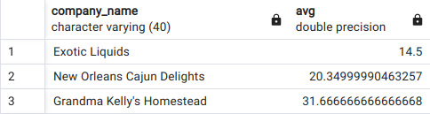
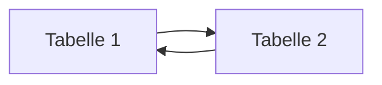
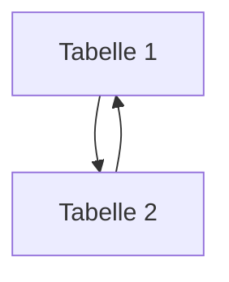

# Structured Query Language (SQL)

+ SQL erlaubt die Abfrage, das Editieren, Ändern und Löschen von Informationen in einer Datenbank
+ SQL ist standardisiert und funktioniert (fast) auf jedem Datenbanksystem gleich
+ American National Standards Institute (ANSI) in 1986, und von der International Organization for Standardization (ISO) in 1987
+ Standardisierung ermöglicht eine weite Verbreitung und Nutzung -> nicht jedes System hat seinen eigenen Standard, da Kompatibilität gewahrt bleibt
+ Allerdings hat jedes Datenbanksystem auch immer noch Abweichungen (flavours, dialects)  und eigene Implementationen  
+ SQL gehört zur 4. Generation (4GL) an Programmiersprachen und ist rein deklarativ:
  + Daten werden angefordert, man hat aber keinen Einfluss, wie diese Daten abgeholt werden
  + Diese Logik ist komplett dem RDMS überlassen 

## SQL auf einen Blick

Statement| Zugehörig
------- | -------
SELECT | Data retrieval (Abfrage)
CREATE<br>ALTER<br>DROP | Data definition language (DDL) 
INSERT<br>UPDATE<br>DELETE<br>MERGE<br>TRUNCATE<br> | Data manipulation language (DML)    
COMMIT<br>ROLLBACK<br>SAVEPOINT<br> | Transaction control
GRANT<br>REVOKE<br> | Data control language (DCL)

+ :heavy_check_mark: Dies sind bereits alle möglichen SQL-Statements
+ Data definition language (DDL) ermöglicht das Erstellen oder Ändern des Datenmodells
+ Data Manipulation Language (DML) bezieht sich auf die Daten selbst, also das Hinzufügen, Ändern oder Löschen von Daten
+ Transaction control erzwingt die Konsistenz beim Schreiben der Daten
+ Data Control Language (DCL) richtet die Zugangskontrolle für Datenbankobjekte ein. Über Nutzer und Rollen kann ein sehr filigraner Zugriffsschutz erstellt werden 

### Datenabfrage (SELECT)

+ SELECT ist ein sehr mächtiger Befehl, um Daten aus Tabellen abzufragen
+ Wenn die Daten bereits definiert sind (DDL), bewegt man sich fast ausschließlich mit diesem Befehl, um Daten zu analysieren und auszuwerten
+ Daten können sehr effizient zusammengefügt und verbunden werden. 
  + Die Analyse von Daten wird im Vergleich zu z. B. Excel wesentlich flexibler und einfacher

```sql
-- Ich bin ein Kommentar
SELECT * FROM products;
```
+ :arrow_up: Zur Einführung ein Code-Beispiel, wie wir es auf den nächsten Seiten öfter sehen werden

+ :arrow_down: Ein wichtiger Einstieg in SQL ist die Selektion von Spalten und Zeilen, fangen wir mit den Spalten an: 

```sql
-- Wie selektiere ich Spalten?
SELECT product_name, quantity_per_unit FROM products;
```
+ :information_source: :arrow_down: Ein SELECT-Statement kann folgende Keywords enthalten:

Keyword | Beschreibung
:--- | -------:
<span style="color:blue">**SELECT**</span> | Filtert Spalten ("*" für alle)
<span style="color:blue">**FROM**</span> | Tabelle
<span style="color:blue">**WHERE**</span> | Filtert Zeilen
<span style="color:blue">**GROUP BY**</span> | Ermöglicht das Aggregieren auf Spalten, z. B. mit SUM(), MAX(), MIN(), COUNT(), AVG()
<span style="color:blue">**HAVING**</span> | Filtert wieder Zeilen **nach** dem Aggregieren
<span style="color:blue">**ORDER BY**</span> | Sortiert Ergebnis nach Spalte
<span style="color:blue">**LIMIT**</span> | Limitiert die Ergebnisse auf eine bestimmte Anzahl, z. B. 100 | 

### Operatoren

+ Wie selektiere (filtere) ich Zeilen? :arrow_down::

#### Arithmetisch

Operator | Bedeutung
---------|----------
= | ist gleich
< | kleiner
<= | kleiner gleich
\> | größer
\>= | größer gleich
<> oder != | ungleich

#### Null-Werte

Operator | Bedeutung
---------|----------
is Null | Null-Werte 
is not Null | nicht Null-Werte

+ :information_source: Null-Werte stehen für unbekannte Werte 

```sql
-- Alle Produkte größer gleich $50
SELECT * FROM products
WHERE unit_price >= 50
```
#### AND, NOT, OR

Operator | Beschreibung
---------|-------------
AND | Alle Bedingungen müssen erfüllt sein
OR | Nur eine Bedingung muss erfüllt sein
NOT | Negation 

##### Beispiele
```sql
-- Alle Produkte, die mit "A" anfangen UND über 50 $ kosten
SELECT ... WHERE product_name LIKE 'A%' and unit_price > 50
-- Alle Produkte, die **nicht** mit "B" anfangen 
SELECT ... WHERE product_name NOT LIKE ('B%')  
```

```sql
-- Welche Produkte kosten über $50?
SELECT product_id, product_name
FROM products
WHERE unit_price >= 50;
```
+ Eine Besonderheit im `WHERE` Keyword ist das Filtern mit `LIKE`:

```sql 
SELECT * FROM products
-- 1) Mit "A" startet
WHERE productname LIKE 'A%'  
-- 2) "A" enthält
WHERE productname LIKE '%a%'
-- 3) Mit "A" endet
WHERE productname LIKE '%a'
```

### Aggregate Functions

+ Aggregatfunktionen sind Funktionen, die über alle oder bestimmte Spalten aggregieren 
+ :arrow_up: Beispiele siehe `GROUP BY` oben

```sql
-- Was ist das teuerste Produkt? (Aggregation auf gesamte Tabelle)
SELECT MAX(unit_price) 
FROM products;
```

```sql
-- Was ist der Durchschnittspreis pro Händler? (Aggregation auf eine Spalte (supplier_id))
SELECT supplier_id, AVG(unit_price) 
FROM products
GROUP BY supplier_id
ORDER BY avg
```
+ :arrow_up: :exclamation: Jede Spalte, die im `SELECT ` Keyword auftaucht, muss auch im `GROUP BY` Keyword vorkommen

```sql
-- Geht das bitte mit aufgelöstem Händlername?
SELECT company_name, avg FROM suppliers
LEFT JOIN
(SELECT supplier_id, AVG(unit_price) 
FROM products
GROUP BY supplier_id
ORDER BY avg) ave_price ON suppliers.supplier_id=ave_price.supplier_id
```



## SQL JOINS



+ :arrow_up: Tabellen werden hier horizontal verbunden, d.h. die Spaltenanzahl erhöht sich bis auf alle Spalten von beiden Tabellen (solange keine Spaltenselektion vorgenommen wird)
+ JOINS verbinden Tabellen (in der Regel) auf einen bestimmten Schlüssel -> referentielle Integrität
+ So können Daten wieder denormalisiert werden und lesbar gemacht werden. 
+ Wir erinnern uns: Datentabellen enthalten nur Schlüssel, ähnlich wie hier (order_details):

customer_id | product_id | Kaufdatum
-----------|------------|----------
1 | 14 | 01.04.2024
2 | 16 | 03.01.2025

+ :arrow_up: Um Daten wieder lesbar zu machen, müssen Sie über einen JOIN wieder verknüpft werden, d. h. die Schlüssel (hier Fremdschlüssel) der Primärtabelle angehängt werden

```sql
--Welche Firma (customer) hat welche Produkte gekauft? 
SELECT company_name, product_name FROM order_details
LEFT JOIN orders ON order_details.order_id=orders.order_id
LEFT JOIN customers ON orders.customer_id=customers.customer_id
LEFT JOIN products on order_details.product_id=products.product_id
WHERE order_details.order_id=10248
```

+ JOINS können INNER, OUTER oder CROSS sein


[Source: https://www.linkedin.com/pulse/sql-inner-join-tutorial-matt-l](https://www.linkedin.com/pulse/sql-inner-join-tutorial-matt-l)

## SET Operatoren

SET operators

+ :arrow_up: SET Operatoren hängen Tabellen zusammen bzw. finden die Differenz in den Zeilen
+ :exclamation: Hierfür müssen die Tabellen, die exakt gleiche Anzahl an Spalten und gleiche Datentypen haben
+ SET Operatoren verbinden Tabellen vertikal, sie erhöhen oder vermindern die Zeilenanzahl

Operator | Bedeutung
---------|----------
UNION oder UNION ALL | Hängt 2 Tabellen aneinander, UNION ALL erlaubt Duplikate, UNION entfernt diese
INTERSECT | gibt die Menge der überschneidenden Elemente zurück (d. h. sowohl in Tabelle 1 als auch 2 enthalten) 
MINUS | findet die Menge, die nur in der einen, nicht aber in der anderen Tabelle ist 

```sql
SELECT product_name, quantity_per_unit, unit_price FROM products
INTERSECT
SELECT product_name, quantity_per_unit, unit_price FROM products
WHERE product_id != 1
```